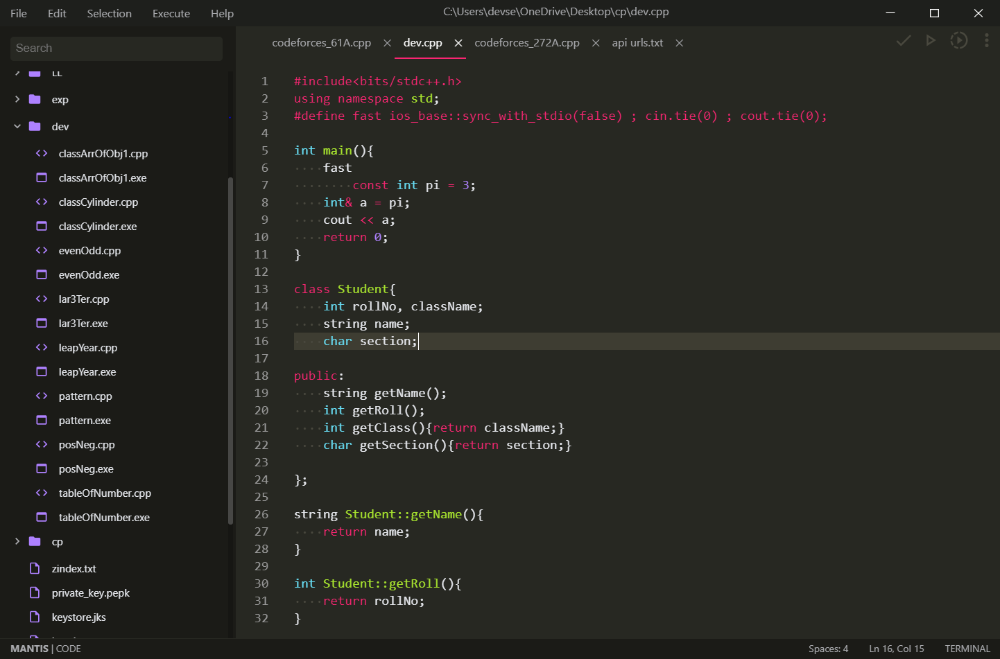

# Mantis | CODE

[](https://github.com/devsebastian/mantis/issues) 
[]()
[](https://github.com/devsebastian/mantis/blob/master/LICENSE) 

> Mantis is still in its very early stages. Breaking changes might result in the app crashing or not working as intended.


## Getting the Sources
First, fork the mantis repository so that you can make a pull request. Then, clone your fork locally:
git clone https://github.com/[your-github-account]/mantis.git
Occasionally you will want to merge changes in the upstream repository (the official code repo) with your fork.

```
cd mantis
git checkout master
git pull https://github.com/devsebastian/mantis.git master
```
Manage any merge conflicts, commit them, and then push them to your fork.

To setup all node modules, in the terminal run:
```
npm install
```
 
## Production
in the terminal just run
```
yarn dev
```
OR
```
npm run dev
```
## License
Copyright (c) 2020 Dev Sebastian.

Licensed under the MIT license.
